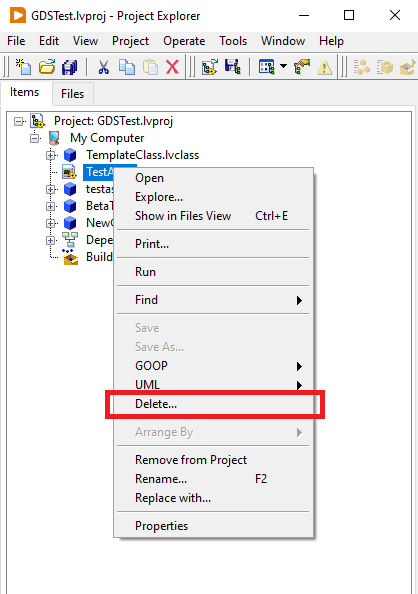
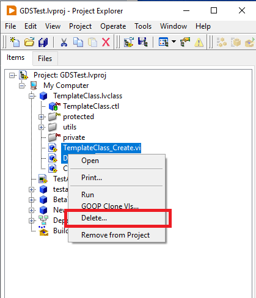

# LVDeleteFile

 

Plugin for the LabVIEW IDE to add a rightclick option for files in the project to delete te file from disk and the project

## Filettypes
For now the only file types that support being deleted from the project are:
- .vi
- .ctl

## Requirements
- LV2018 or higher

